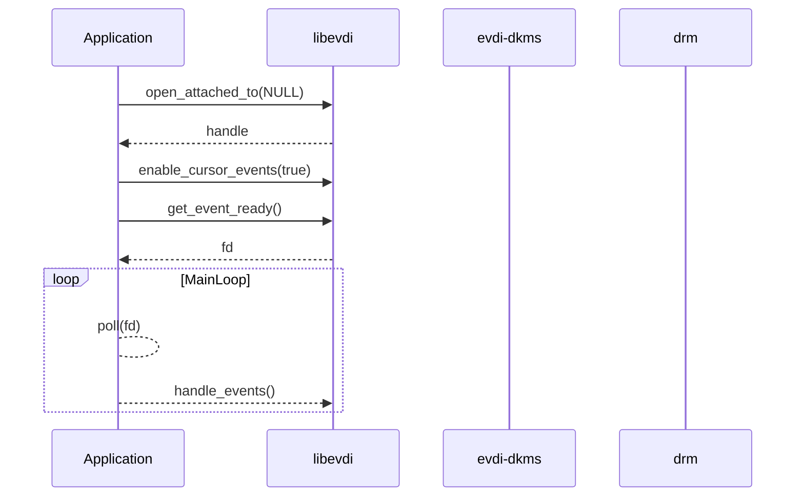

# EVDI

```mermaid
sequenceDiagram
    participant A as Application
    participant E as libevdi
    participant K as evdi-dkms
    participant D as drm


    A->>E: open_attached_to(NULL)
    E-->>A: handle
    A->>E: enable_cursor_events(true)
    A->>E: get_event_ready()
    E-->>A: fd

    loop MainLoop
    A-->A: poll(fd)
    A-->>E: handle_events()
    end
```
