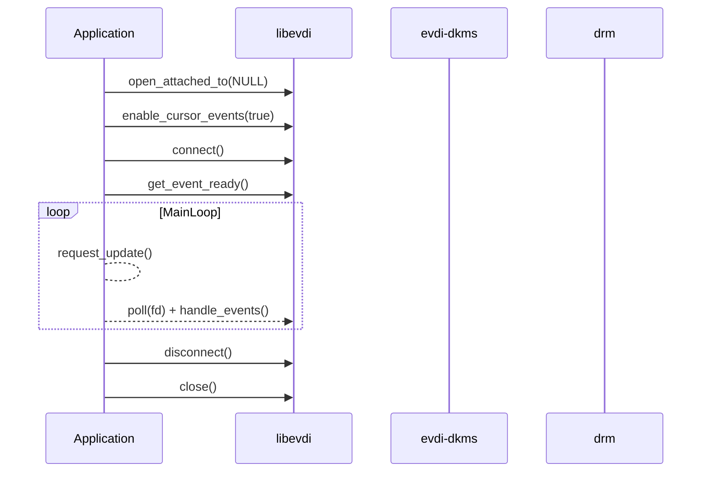

# EVDI

```mermaid
sequenceDiagram
    participant A as Application
    participant E as libevdi
    participant K as evdi-dkms
    participant D as drm


    A->>E: open_attached_to(NULL)
    A->>E: enable_cursor_events(true)
    A->>E: connect()
    A->>E: get_event_ready()

    loop MainLoop
    A-->A: request_update()
    A-->>E: poll(fd) + handle_events()
    end

    A->>E: disconnect()
    A->>E: close()

```
